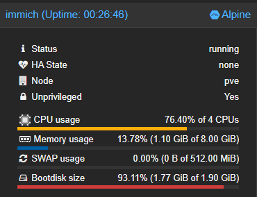
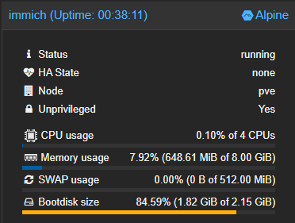

# immich-alpine
Run immich server on Alpine Linux. No building required.

This follows the immich versions for every x.y.z release. Support started from v3.2.0. Anything before that is not
supported. Though, you are welcome to try them out, but it won't be as simple as running the install script.

> [!WARNING]
> I have validated that this works, but I have not tested it extensively. I do not make any guarantees. Please test and
> let me know if you find any issues, or not. (tell me it works fine please!)

**I HAVE ALSO NOT TESTED THE UPGRADE PATH WITH THE INSTALL SCRIPT. I WILL DO SO WHEN I HAVE THE TIME AFTER THE NEXT
IMMICH RELEASE IS OUT.**

## Installation

```bash
# Download the install script
wget -O install-immich-alpine.sh \
  https://raw.githubusercontent.com/ronhombre/immich-alpine/main/install-immich-alpine.sh
chmod +x install-immich-alpine.sh

# Install a specific release (starting from v3.2.0)
./install-immich-alpine.sh v3.2.0 ronhombre/immich-alpine
```

## Example (Working)


In this setup, I'm using [proxmox](https://www.proxmox.com/) to run the server in an unprivileged container. As seen in
figures above, the server is using significantly less memory than the immich-native version. This was what I wanted and
the main reason I started this project.

This uses a mounted 72GB volume for the files, and another VM for Postgres and Redis.

Looking at this, it might be a good idea to separate the machine-learning app from the main server, but that is a
project for a future me.

### Issues I encountered
- I also mounted the ML cache as a 2GB volume. Remember to set `chown immich:immich /var/lib/immich/cache` because I
forgot and that was a headache of its own.
- I had to avoid using my pgbouncer backend because its transaction pooling mode conflicts with the way immich locks the
sessions. I had to open up my database VM's firewall just for that. (P.S. I have verifySSL enabled)

## How this works
- `.github/workflows/build-immich.yml` builds immich for the current release and attaches the artifacts to the release.
- `build-immich-alpine.sh` builds immich from source in an Alpine Linux container.
- `install-immich-alpine.sh` is an install script that downloads the artifacts from the release and sets it up locally.

## References
- Heavily inspired by [arter97/immich-native](https://github.com/arter97/immich-native). I made this because I wanted to
run Immich on Alpine Linux and reduce the memory footprint. I also hated having to build the server myself every time.

## License
This license strictly applies to the GitHub Workflow config, build script, and install script. It does not mean I am
claiming license ownership of the built artifacts. That still solely depends on Immich's license.
```text
MIT License

Copyright (c) 2026 Ron Lauren Hombre

Permission is hereby granted, free of charge, to any person obtaining a copy
of this software and associated documentation files (the "Software"), to deal
in the Software without restriction, including without limitation the rights
to use, copy, modify, merge, publish, distribute, sublicense, and/or sell
copies of the Software, and to permit persons to whom the Software is
furnished to do so, subject to the following conditions:

The above copyright notice and this permission notice shall be included in all
copies or substantial portions of the Software.

THE SOFTWARE IS PROVIDED "AS IS", WITHOUT WARRANTY OF ANY KIND, EXPRESS OR
IMPLIED, INCLUDING BUT NOT LIMITED TO THE WARRANTIES OF MERCHANTABILITY,
FITNESS FOR A PARTICULAR PURPOSE AND NONINFRINGEMENT. IN NO EVENT SHALL THE
AUTHORS OR COPYRIGHT HOLDERS BE LIABLE FOR ANY CLAIM, DAMAGES OR OTHER
LIABILITY, WHETHER IN AN ACTION OF CONTRACT, TORT OR OTHERWISE, ARISING FROM,
OUT OF OR IN CONNECTION WITH THE SOFTWARE OR THE USE OR OTHER DEALINGS IN THE
SOFTWARE.
```